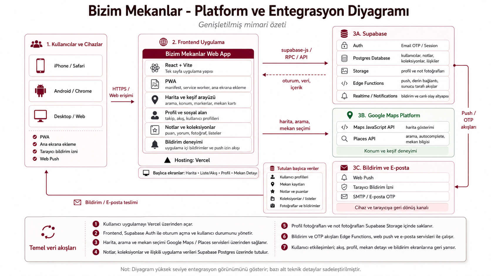

<div align="center">
  

  # Bizim Mekanlar

  **Mekânları keşfet, deneyimlerini kaydet ve arkadaşlarınla paylaş.**

  Mobil öncelikli sosyal mekân günlüğü ve PWA.

  [Canlı Uygulamayı Aç](https://bizimmekanlar.com)
</div>

---

## Proje Hakkında

Bizim Mekanlar; kafe, restoran, bar ve diğer sosyal mekânları harita üzerinden keşfetmeyi, ziyaretleri kişisel notlarla kaydetmeyi ve arkadaşların deneyimlerini takip etmeyi sağlayan bir web uygulamasıdır.

Proje, klasik bir mekân listeleme servisinden ziyade kullanıcıların kendi deneyim arşivini oluşturmasına odaklanır. Notlar, puanlar, fotoğraflar, koleksiyonlar ve sosyal etkileşimler tek bir mobil öncelikli deneyimde bir araya gelir.

## Öne Çıkan Özellikler

- Google Maps üzerinde mekân arama ve seçme
- Mekânlara başlık, puan, açıklama, ziyaret tarihi ve fotoğraf içeren notlar ekleme
- Aynı mekâna birden fazla ziyaret kaydı oluşturma
- Mekânları kişisel veya ortak koleksiyonlarda düzenleme
- Kullanıcı profilleri, takip sistemi ve gizli hesap desteği
- Takip edilen kullanıcıların notlarını akışta görüntüleme
- Notlara tepki verme ve uygulama içi bildirimler
- Desteklenen cihazlarda Web Push bildirimleri
- Profil, not, mekân ve koleksiyon bağlantılarını paylaşma
- Telefona yüklenebilen mobil öncelikli PWA deneyimi

## Teknoloji Yığını

| Alan | Teknoloji |
|---|---|
| Frontend | React, Vite, JavaScript |
| Stil | Plain CSS |
| Harita ve mekân arama | Google Maps JavaScript API, Places API |
| Backend | Supabase |
| Veritabanı | PostgreSQL |
| Kimlik doğrulama | Supabase Auth, Email OTP |
| Dosya depolama | Supabase Storage |
| Sunucu tarafı işlemler | Supabase Edge Functions |
| Bildirimler | Uygulama içi bildirimler, Web Push |
| Hosting | Vercel |
| Uygulama türü | Progressive Web App |

## Mimari

<p align="center">
  
</p>

Frontend, Vercel üzerinde yayınlanır. Kimlik doğrulama, uygulama verileri, fotoğraflar, gerçek zamanlı güncellemeler ve sunucu tarafı işlemler Supabase servisleri üzerinden yönetilir.

## Yerel Geliştirme

### Gereksinimler

- Node.js 20 veya üzeri
- npm
- Bir Supabase projesi
- Google Maps Platform API erişimi

### Kurulum

```bash
git clone https://github.com/3kutlu/bizim-mekanlar.git
cd bizim-mekanlar
npm install
```

Proje kökünde bir `.env.local` dosyası oluştur:

```env
VITE_SUPABASE_URL=
VITE_SUPABASE_PUBLISHABLE_KEY=
VITE_GOOGLE_MAPS_API_KEY=
VITE_GOOGLE_MAP_ID=
VITE_VAPID_PUBLIC_KEY=
```

Geliştirme sunucusunu başlat:

```bash
npm run dev
```

## Proje Yapısı

```text
public/                 PWA dosyaları ve statik varlıklar
src/                    React kaynak kodları
supabase/functions/     Edge Functions
supabase/migrations/    Veritabanı migration dosyaları
```

## Güvenlik

- Hassas anahtarlar kaynak kodda tutulmaz.
- Ortam değişkenleri yerel ve platform secret alanlarında yönetilir.
- Veritabanı erişimleri Row Level Security politikalarıyla sınırlandırılır.
- Güvenlik gerektiren işlemler istemci yerine sunucu tarafında yürütülür.
- E-posta OTP kayıt akışında geçici ve kabul edilmeyen e-posta domainleri kontrol edilir.

## Proje Durumu

Bizim Mekanlar aktif olarak geliştirilmektedir. Ürün deneyimi, sosyal özellikler, harita etkileşimleri ve performans iyileştirmeleri düzenli olarak geliştirilmeye devam etmektedir.

## Geri Bildirim

Hata bildirimi, öneri veya proje hakkındaki görüşler için:

[3kutlu@gmail.com](mailto:3kutlu@gmail.com)

## Lisans

Bu proje kişisel bir yazılım projesidir. Açıkça belirtilmiş bir lisans bulunmadığı sürece tüm hakları saklıdır.
